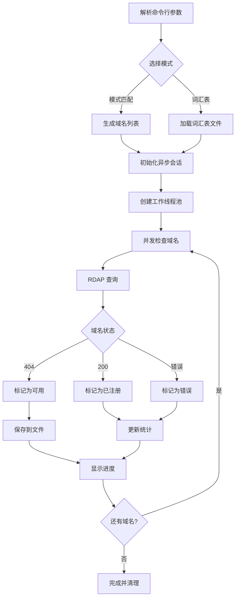

# RChecker

一个高性能的异步域名可用性检查工具，支持模式匹配和词汇表模式，具有断点续传功能。

**语言:** [中文](README-CN.md) | [English](README.md)

<!-- PROJECT SHIELDS -->

[![Contributors][contributors-shield]][contributors-url]
[![Forks][forks-shield]][forks-url]
[![Stargazers][stars-shield]][stars-url]
[![Issues][issues-shield]][issues-url]
[![MIT License][license-shield]][license-url]

<!-- PROJECT LOGO -->
<br />

<p align="center">
  <a href="https://github.com/Rain-kl/RChecker">
    
  </a>

  <h3 align="center">RChecker</h3>
  <p align="center">
    一个快速、高效的域名可用性检查工具
    <br />
    <a href="https://github.com/Rain-kl/RChecker"><strong>探索本项目的文档 »</strong></a>
    <br />
    <br />
    <a href="https://github.com/Rain-kl/RChecker">查看Demo</a>
    ·
    <a href="https://github.com/Rain-kl/RChecker/issues">报告Bug</a>
    ·
    <a href="https://github.com/Rain-kl/RChecker/issues">提出新特性</a>
  </p>

</p>

## 项目简介

RChecker 是一个专业的域名可用性检查工具，使用异步 HTTP 请求和 RDAP 协议来高效检查大量域名的注册状态。该工具支持多种操作模式，包括模式匹配生成、词汇表导入、断点续传等功能。

### 主要特性

- 🚀 **高性能异步检查**: 使用 aiohttp 实现并发域名查询
- 🎯 **多种生成模式**: 支持模式匹配和词汇表两种域名生成方式
- 📊 **实时进度显示**: 带有详细统计信息的进度条
- 💾 **断点续传**: 支持中断后从上次位置继续检查
- 🌐 **在线词汇表**: 内置多种在线词汇表源下载功能
- ⚡ **速率限制**: 可配置的请求速率控制
- 📝 **结果导出**: 自动保存可用域名到文件

## 目录

- [上手指南](#上手指南)
  - [环境要求](#环境要求)
  - [安装步骤](#安装步骤)
- [使用方法](#使用方法)
  - [基本用法](#基本用法)
  - [高级选项](#高级选项)
  - [词汇表模式](#词汇表模式)
- [文件目录说明](#文件目录说明)
- [配置选项](#配置选项)
- [贡献者](#贡献者)
- [版本控制](#版本控制)
- [许可证](#许可证)

## 上手指南

### 环境要求

- Python 3.8 或更高版本
- 稳定的网络连接
- 足够的磁盘空间用于存储结果和进度文件

### 安装步骤

#### 选项 1: 从 PyPI 安装（推荐）
```bash
pip install rchecker
```

#### 选项 2: 从源码安装
1. 克隆仓库
```bash
git clone https://github.com/Rain-kl/RChecker.git
cd RChecker
```

2. 开发模式安装
```bash
pip install -e .
```

或者使用 uv（推荐）：
```bash
uv sync
```

3. 运行工具
```bash
rchecker --help
```

## 使用方法

### 基本用法

#### 1. 模式匹配模式
检查以特定前缀开头的域名：
```bash
# 检查所有 3 位长度的 .com 域名
rchecker "a*" --max 3 --tld com

# 检查特定前缀的域名
rchecker "app*" --max 6 --min 4 --tld com
```

#### 2. 精确域名检查
```bash
# 检查单个域名
rchecker "example" --max 7 --min 7 --tld com
```

#### 3. 词汇表模式
```bash
# 使用自定义词汇表
rchecker --wordlist words.txt --max 10 --tld com

# 下载并使用在线词汇表
rchecker download common-small
rchecker --wordlist google-10000-english-usa.txt --max 8 --tld com
```

### 高级选项

#### 性能调优
```bash
# 调整并发数和请求速率
rchecker "test*" --max 5 --concurrency 20 --rate 100

# 设置超时和重试次数
rchecker "app*" --max 6 --timeout 15 --retries 3
```

#### 断点续传
```bash
# 启用断点续传功能
rchecker "data*" --max 6 --resume --progress-file my_progress.json

# 随机化检查顺序
rchecker "api*" --max 5 --shuffle
```

#### 自定义输出
```bash
# 指定输出文件
rchecker "web*" --max 5 --output available_web_domains.txt

# 禁用进度条
rchecker "blog*" --max 6 --no-progress
```

### 词汇表模式

#### 查看可用的在线词汇表
```bash
rchecker download list
```

#### 下载词汇表
```bash
# 下载常用英文单词
rchecker download common-small

# 下载到指定位置
rchecker download names --output first_names.txt

# 强制覆盖已存在的文件
rchecker download adjectives --force
```

#### 内置词汇表源

| 名称           | 描述                         | 单词数量 |
| -------------- | ---------------------------- | -------- |
| `common`       | 常用英文单词                 | 370,000+ |
| `common-small` | 最常用的英文单词             | 10,000   |
| `common-tiny`  | 最常用英文单词（无不雅词汇） | 10,000   |
| `names`        | 常见英文名字                 | 5,000+   |
| `adjectives`   | 英文形容词                   | 1,300+   |

## 文件目录说明

```
RChecker/
├── rchecker/               # 主包目录
│   ├── __init__.py         # 包初始化文件
│   ├── main.py             # 核心功能
│   └── cli.py              # 命令行接口
├── pyproject.toml          # 项目配置文件
├── MANIFEST.in             # 包清单文件
├── LICENSE.txt             # MIT 许可证
├── README.md               # 项目说明文档（英文版）
├── README-CN.md            # 项目说明文档（中文版）
├── README.en.md            # 项目说明文档（英文版）
├── README copy.md          # README 模板文件
├── uv.lock                 # 依赖锁定文件
├── __pycache__/           # Python 缓存目录
├── images/                # 图片资源目录
│   └── logo.png           # 项目 Logo
├── available_domains.txt   # 默认输出文件（运行后生成）
└── .dcheck_progress.json  # 进度文件（断点续传时生成）
```

## 配置选项

### 命令行参数详解

| 参数              | 类型   | 默认值                  | 说明                           |
| ----------------- | ------ | ----------------------- | ------------------------------ |
| `pattern`         | 字符串 | -                       | 域名模式（支持末尾通配符 `*`） |
| `--tld`           | 字符串 | `com`                   | 顶级域名                       |
| `--max`           | 整数   | 必需                    | 域名最大长度                   |
| `--min`           | 整数   | 等于 max                | 域名最小长度                   |
| `--rate`          | 浮点数 | `50.0`                  | 每秒最大请求数（0 为无限制）   |
| `--concurrency`   | 整数   | `15`                    | 并发工作线程数                 |
| `--timeout`       | 浮点数 | `10.0`                  | HTTP 请求超时时间（秒）        |
| `--charset`       | 字符串 | `a-z`                   | 通配符展开使用的字符集         |
| `--retries`       | 整数   | `2`                     | 失败请求重试次数               |
| `--output`        | 字符串 | `available_domains.txt` | 结果输出文件                   |
| `--wordlist`      | 字符串 | -                       | 词汇表文件路径                 |
| `--resume`        | 布尔值 | `False`                 | 启用断点续传                   |
| `--progress-file` | 字符串 | `.dcheck_progress.json` | 进度文件路径                   |
| `--shuffle`       | 布尔值 | `False`                 | 随机化检查顺序                 |
| `--no-progress`   | 布尔值 | `False`                 | 禁用进度条                     |

### 性能建议

- **并发数**: 对于大多数网络环境，15-30 的并发数是合适的
- **请求速率**: 建议设置为 10-100 requests/second，避免被限制
- **超时时间**: 网络较慢时可以增加到 15-30 秒
- **重试次数**: 对于不稳定的网络，可以增加到 3-5 次

## 技术架构

### 核心组件

1. **异步网络层**: 基于 `aiohttp` 实现高并发 HTTP 请求
2. **RDAP 协议**: 使用标准 RDAP 接口查询域名注册信息
3. **进度管理**: 实现断点续传和实时进度显示
4. **速率控制**: 防止请求过快被服务器限制
5. **结果处理**: 自动分类和保存检查结果

### 工作流程



## 贡献者

感谢所有为这个项目做出贡献的开发者！

### 如何参与开源项目

1. Fork 本项目
2. 创建您的特性分支 (`git checkout -b feature/AmazingFeature`)
3. 提交您的更改 (`git commit -m 'Add some AmazingFeature'`)
4. 推送到分支 (`git push origin feature/AmazingFeature`)
5. 打开一个 Pull Request

## 版本控制

该项目使用 [SemVer](http://semver.org/) 语义化版本号进行版本管理。您可以查看 [Releases](https://github.com/Rain-kl/RChecker/releases) 来查看可用版本。

### 更新日志

- **v0.1.0** - 初始版本
  - 基本域名检查功能
  - 模式匹配和词汇表支持
  - 异步并发处理
  - 断点续传功能

## 许可证

该项目基于 MIT 许可证开源 - 查看 [LICENSE.txt](LICENSE.txt) 文件了解详细信息。

## 常见问题

### Q: 为什么有些域名检查失败？
A: 可能的原因包括网络超时、RDAP 服务器临时不可用、或者域名格式不符合规范。工具会自动重试失败的请求。

### Q: 如何提高检查速度？
A: 可以适当增加 `--concurrency` 和 `--rate` 参数值，但要注意不要设置得过高，以免被服务器限制。

### Q: 支持哪些顶级域名？
A: 支持所有在 RDAP 系统中注册的顶级域名，包括 .com、.net、.org、.cn 等。

### Q: 结果文件格式是什么？
A: 输出文件是纯文本格式，每行一个可用的域名，方便后续处理。

---

<p align="center">
  如果这个项目对您有帮助，请给它一个 ⭐
</p>

<!-- MARKDOWN LINKS & IMAGES -->
[contributors-shield]: https://img.shields.io/github/contributors/Rain-kl/RChecker.svg?style=flat-square
[contributors-url]: https://github.com/Rain-kl/RChecker/graphs/contributors
[forks-shield]: https://img.shields.io/github/forks/Rain-kl/RChecker.svg?style=flat-square
[forks-url]: https://github.com/Rain-kl/RChecker/network/members
[stars-shield]: https://img.shields.io/github/stars/Rain-kl/RChecker.svg?style=flat-square
[stars-url]: https://github.com/Rain-kl/RChecker/stargazers
[issues-shield]: https://img.shields.io/github/issues/Rain-kl/RChecker.svg?style=flat-square
[issues-url]: https://github.com/Rain-kl/RChecker/issues
[license-shield]: https://img.shields.io/github/license/Rain-kl/RChecker.svg?style=flat-square
[license-url]: https://github.com/Rain-kl/RChecker/blob/master/LICENSE.txt
