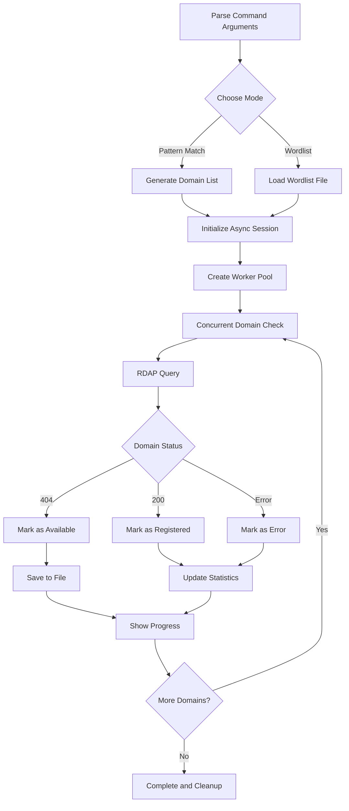

# Domain Checker

A high-performance asynchronous domain availability checker supporting pattern matching and wordlist modes with checkpoint/resume functionality.

**Language:** [中文](README-CN.md) | [English](README.md)

<!-- PROJECT SHIELDS -->

[![Contributors][contributors-shield]][contributors-url]
[![Forks][forks-shield]][forks-url]
[![Stargazers][stars-shield]][stars-url]
[![Issues][issues-shield]][issues-url]
[![MIT License][license-shield]][license-url]

<!-- PROJECT LOGO -->
<br />

<p align="center">
  <a href="https://github.com/Rain-kl/RChecker">
    
  </a>

  <h3 align="center">Domain Checker</h3>
  <p align="center">
    A fast and efficient domain availability checking tool
    <br />
    <a href="https://github.com/Rain-kl/RChecker"><strong>Explore the docs »</strong></a>
    <br />
    <br />
    <a href="https://github.com/Rain-kl/RChecker">View Demo</a>
    ·
    <a href="https://github.com/Rain-kl/RChecker/issues">Report Bug</a>
    ·
    <a href="https://github.com/Rain-kl/RChecker/issues">Request Feature</a>
  </p>

</p>

## Project Overview

Domain Checker is a professional domain availability checking tool that uses asynchronous HTTP requests and the RDAP protocol to efficiently check the registration status of large numbers of domains. The tool supports multiple operation modes, including pattern matching generation, wordlist import, and checkpoint/resume functionality.

### Key Features

- 🚀 **High-Performance Async Checking**: Concurrent domain queries using aiohttp
- 🎯 **Multiple Generation Modes**: Supports both pattern matching and wordlist domain generation
- 📊 **Real-time Progress Display**: Progress bar with detailed statistics
- 💾 **Checkpoint/Resume**: Resume from where you left off after interruption
- 🌐 **Online Wordlists**: Built-in download functionality for various online wordlist sources
- ⚡ **Rate Limiting**: Configurable request rate control
- 📝 **Result Export**: Automatically save available domains to file

## Table of Contents

- [Getting Started](#getting-started)
  - [Prerequisites](#prerequisites)
  - [Installation](#installation)
- [Usage](#usage)
  - [Basic Usage](#basic-usage)
  - [Advanced Options](#advanced-options)
  - [Wordlist Mode](#wordlist-mode)
- [File Structure](#file-structure)
- [Configuration Options](#configuration-options)
- [Contributors](#contributors)
- [Versioning](#versioning)
- [License](#license)

## Getting Started

### Prerequisites

- Python 3.12 or higher
- Stable internet connection
- Sufficient disk space for storing results and progress files

### Installation

1. Clone the repository
```bash
git clone https://github.com/Rain-kl/RChecker.git
cd domain-checker
```

2. Install dependencies
```bash
pip install aiohttp tqdm
```

Or using uv (recommended):
```bash
uv sync
```

3. Run the tool
```bash
python rchecker.py --help
```

## Usage

### Basic Usage

#### 1. Pattern Matching Mode
Check domains starting with specific prefixes:
```bash
# Check all 3-character .com domains
python rchecker.py "a*" --max 3 --tld com

# Check domains with specific prefix
python rchecker.py "app*" --max 6 --min 4 --tld com
```

#### 2. Exact Domain Check
```bash
# Check single domain
python rchecker.py "example" --max 7 --min 7 --tld com
```

#### 3. Wordlist Mode
```bash
# Use custom wordlist
python rchecker.py --wordlist words.txt --max 10 --tld com

# Download and use online wordlist
python rchecker.py download common-small
python rchecker.py --wordlist google-10000-english-usa.txt --max 8 --tld com
```

### Advanced Options

#### Performance Tuning
```bash
# Adjust concurrency and request rate
python rchecker.py "test*" --max 5 --concurrency 20 --rate 100

# Set timeout and retry count
python rchecker.py "app*" --max 6 --timeout 15 --retries 3
```

#### Checkpoint/Resume
```bash
# Enable checkpoint/resume functionality
python rchecker.py "data*" --max 6 --resume --progress-file my_progress.json

# Randomize check order
python rchecker.py "api*" --max 5 --shuffle
```

#### Custom Output
```bash
# Specify output file
python rchecker.py "web*" --max 5 --output available_web_domains.txt

# Disable progress bar
python rchecker.py "blog*" --max 6 --no-progress
```

### Wordlist Mode

#### View Available Online Wordlists
```bash
python rchecker.py download list
```

#### Download Wordlists
```bash
# Download common English words
python rchecker.py download common-small

# Download to specific location
python rchecker.py download names --output first_names.txt

# Force overwrite existing file
python rchecker.py download adjectives --force
```

#### Built-in Wordlist Sources

| Name           | Description                              | Word Count |
| -------------- | ---------------------------------------- | ---------- |
| `common`       | Common English words                     | 370,000+   |
| `common-small` | Most common English words                | 10,000     |
| `common-tiny`  | Most common English words (no profanity) | 10,000     |
| `names`        | Common first names                       | 5,000+     |
| `adjectives`   | English adjectives                       | 1,300+     |

## File Structure

```
domain-checker/
├── rchecker.py              # Main program file
├── pyproject.toml          # Project configuration
├── LICENSE.txt             # MIT License
├── README.md               # Project documentation (Chinese)
├── README.en.md            # Project documentation (English)
├── README copy.md          # README template
├── uv.lock                 # Dependency lock file
├── __pycache__/           # Python cache directory
├── images/                # Image resources
│   └── logo.png           # Project logo
├── available_domains.txt   # Default output file (generated after run)
└── .dcheck_progress.json  # Progress file (generated with checkpoint)
```

## Configuration Options

### Command Line Arguments

| Parameter         | Type    | Default                 | Description                                     |
| ----------------- | ------- | ----------------------- | ----------------------------------------------- |
| `pattern`         | String  | -                       | Domain pattern (supports trailing wildcard `*`) |
| `--tld`           | String  | `com`                   | Top-level domain                                |
| `--max`           | Integer | Required                | Maximum domain length                           |
| `--min`           | Integer | Equal to max            | Minimum domain length                           |
| `--rate`          | Float   | `50.0`                  | Maximum requests per second (0 for unlimited)   |
| `--concurrency`   | Integer | `15`                    | Number of concurrent workers                    |
| `--timeout`       | Float   | `10.0`                  | HTTP request timeout (seconds)                  |
| `--charset`       | String  | `a-z`                   | Character set for wildcard expansion            |
| `--retries`       | Integer | `2`                     | Number of retries for failed requests           |
| `--output`        | String  | `available_domains.txt` | Output file for results                         |
| `--wordlist`      | String  | -                       | Path to wordlist file                           |
| `--resume`        | Boolean | `False`                 | Enable checkpoint/resume                        |
| `--progress-file` | String  | `.dcheck_progress.json` | Progress file path                              |
| `--shuffle`       | Boolean | `False`                 | Randomize check order                           |
| `--no-progress`   | Boolean | `False`                 | Disable progress bar                            |

### Performance Recommendations

- **Concurrency**: 15-30 concurrent workers are suitable for most network environments
- **Request Rate**: Recommend 10-100 requests/second to avoid being rate-limited
- **Timeout**: Increase to 15-30 seconds for slower networks
- **Retries**: Increase to 3-5 for unstable networks

## Technical Architecture

### Core Components

1. **Asynchronous Network Layer**: High-concurrency HTTP requests based on `aiohttp`
2. **RDAP Protocol**: Uses standard RDAP interface to query domain registration information
3. **Progress Management**: Implements checkpoint/resume and real-time progress display
4. **Rate Control**: Prevents requests from being too fast and getting server-limited
5. **Result Processing**: Automatic classification and saving of check results

### Workflow



## Contributors

Thanks to all developers who have contributed to this project!

### How to Contribute

1. Fork the project
2. Create your feature branch (`git checkout -b feature/AmazingFeature`)
3. Commit your changes (`git commit -m 'Add some AmazingFeature'`)
4. Push to the branch (`git push origin feature/AmazingFeature`)
5. Open a Pull Request

## Versioning

This project uses [SemVer](http://semver.org/) for versioning. For available versions, see the [Releases](https://github.com/Rain-kl/RChecker/releases).

### Changelog

- **v0.1.0** - Initial release
  - Basic domain checking functionality
  - Pattern matching and wordlist support
  - Asynchronous concurrent processing
  - Checkpoint/resume functionality

## License

This project is licensed under the MIT License - see the [LICENSE.txt](LICENSE.txt) file for details.

## FAQ

### Q: Why do some domain checks fail?
A: Possible reasons include network timeouts, temporary RDAP server unavailability, or non-compliant domain formats. The tool will automatically retry failed requests.

### Q: How to improve checking speed?
A: You can appropriately increase the `--concurrency` and `--rate` parameter values, but be careful not to set them too high to avoid being server-limited.

### Q: Which top-level domains are supported?
A: Supports all top-level domains registered in the RDAP system, including .com, .net, .org, .cn, etc.

### Q: What is the result file format?
A: The output file is in plain text format, one available domain per line, convenient for further processing.

---

<p align="center">
  If this project helps you, please give it a ⭐
</p>

<!-- MARKDOWN LINKS & IMAGES -->
[contributors-shield]: https://img.shields.io/github/contributors/Rain-kl/RChecker.svg?style=flat-square
[contributors-url]: https://github.com/Rain-kl/RChecker/graphs/contributors
[forks-shield]: https://img.shields.io/github/forks/Rain-kl/RChecker.svg?style=flat-square
[forks-url]: https://github.com/Rain-kl/RChecker/network/members
[stars-shield]: https://img.shields.io/github/stars/Rain-kl/RChecker.svg?style=flat-square
[stars-url]: https://github.com/Rain-kl/RChecker/stargazers
[issues-shield]: https://img.shields.io/github/issues/Rain-kl/RChecker.svg?style=flat-square
[issues-url]: https://github.com/Rain-kl/RChecker/issues
[license-shield]: https://img.shields.io/github/license/Rain-kl/RChecker.svg?style=flat-square
[license-url]: https://github.com/Rain-kl/RChecker/blob/master/LICENSE.txt